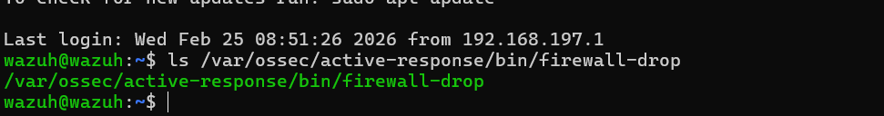
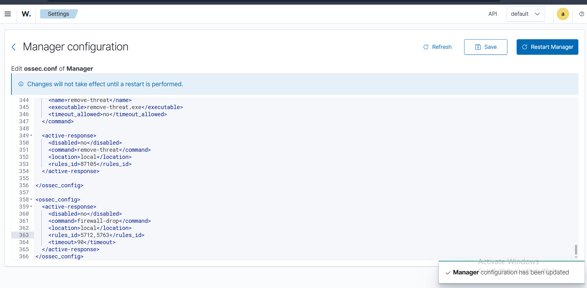
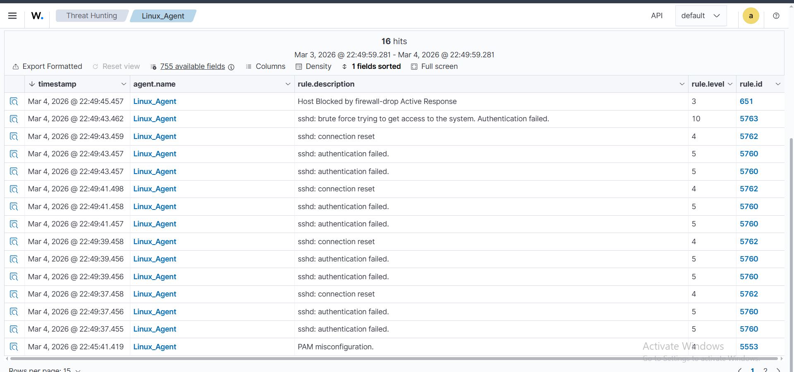

# 🔥 Active Response — Automatic IP Blocking

## Overview

Wazuh's **Active Response** module was configured to automatically block attacking IP addresses using the built-in `firewall-drop` script. When a brute-force SSH attack is detected, Wazuh fires the active response, drops the attacker's IP via firewall rules, and logs the event on the Dashboard.

---

## How It Works

```
SSH Brute Force Attack Detected (rule 5763, level 10)
              │
              ▼
   Wazuh Manager triggers Active Response
              │
              ▼
   firewall-drop script executes on Linux Agent
              │
              ▼
   iptables rule added → Attacker IP blocked for 90s
              │
              ▼
   Alert: "Host Blocked by firewall-drop Active Response" (rule 651)
```

---

## Step 1 — Verify firewall-drop Binary

The `firewall-drop` script is included with Wazuh by default on Linux agents.

```bash
ls /var/ossec/active-response/bin/firewall-drop
```



Output confirms the binary exists at:
```
/var/ossec/active-response/bin/firewall-drop
```

---

## Step 2 — Configure Active Response in ossec.conf

The Active Response block was added to the **Manager configuration** (`ossec.conf`):



```xml
<ossec_config>
  <active-response>
    <disabled>no</disabled>
    <command>firewall-drop</command>
    <location>local</location>
    <rules_id>5712, 5763</rules_id>
    <timeout>90</timeout>
  </active-response>
</ossec_config>
```

| Parameter | Value | Description |
|---|---|---|
| `disabled` | `no` | Active Response is enabled |
| `command` | `firewall-drop` | Built-in script to drop IP via iptables |
| `location` | `local` | Execute on the agent where the event occurred |
| `rules_id` | `5712, 5763` | Trigger on these specific SSH brute-force rule IDs |
| `timeout` | `90` | Block the IP for 90 seconds |

> ✅ *"Manager configuration has been updated"* — Restart Manager to apply.

---

## Step 3 — Active Response Result on Dashboard

After simulating a brute-force SSH attack against the **Linux_Agent**, the full attack sequence and automatic block were captured in Threat Hunting:



**16 total hits** in the observed time window (Mar 3–4, 2026).

### Event Sequence

| Timestamp | Rule Description | Level | Rule ID |
|---|---|---|---|
| Mar 4, 2026 @ 22:49:45 | **Host Blocked by firewall-drop Active Response** | 3 | **651** |
| Mar 4, 2026 @ 22:49:43 | sshd: brute force trying to get access to the system. Authentication failed. | **10** | **5763** |
| Mar 4, 2026 @ 22:49:43 | sshd: connection reset | 4 | 5762 |
| Mar 4, 2026 @ 22:49:43 | sshd: authentication failed | 5 | 5760 |
| Mar 4, 2026 @ 22:49:43 | sshd: authentication failed | 5 | 5760 |
| Mar 4, 2026 @ 22:49:41 | sshd: connection reset | 4 | 5762 |
| ... | sshd: authentication failed (multiple) | 5 | 5760 |

### Attack Timeline

1. Multiple failed SSH authentication attempts trigger rule `5760` (level 5)
2. Wazuh correlates them and fires rule `5763` (level 10) — **Brute Force Detected**
3. `firewall-drop` Active Response executes automatically
4. Rule `651` fires — **Host Blocked by firewall-drop Active Response**

---

## Rule Reference

| Rule ID | Description | Level | Trigger |
|---|---|---|---|
| 5760 | sshd: authentication failed | 5 | Single failed SSH login |
| 5762 | sshd: connection reset | 4 | SSH connection dropped |
| 5763 | sshd: brute force attack | **10** | Multiple failures — triggers AR |
| 651 | Host blocked by firewall-drop | 3 | Active Response confirmation |

---

## Notes

- The IP block is **temporary** — the `firewall-drop` script removes the iptables rule after the configured `timeout` (90 seconds in this lab)
- For **permanent blocks**, the timeout can be removed or set to a very high value
- The Active Response log is stored at `/var/ossec/logs/active-responses.log` on the agent

---

> 🔙 Back to [Main README](../README.md)
