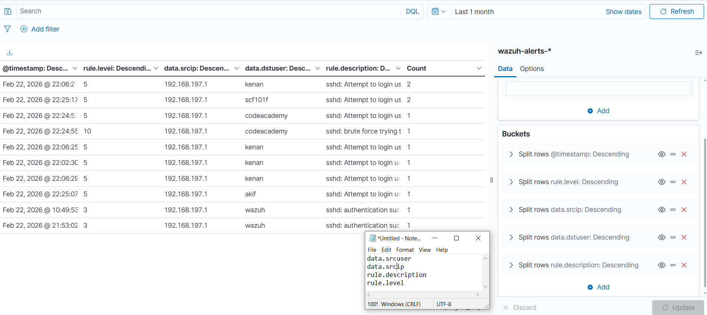
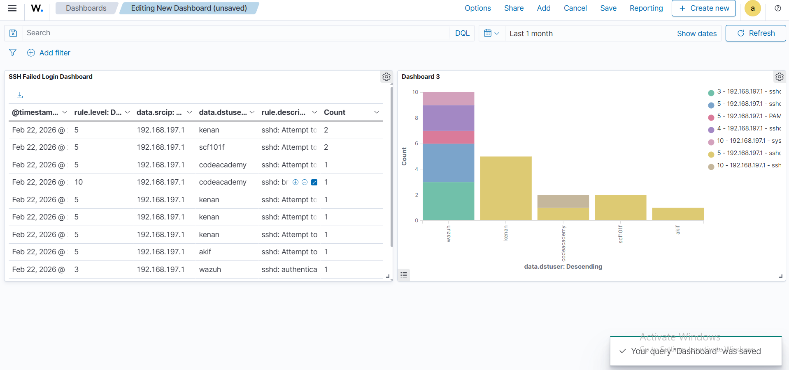

# 📊 Security Dashboard Setup

## Overview

A custom **SSH Failed Login Dashboard** was created in the Wazuh Dashboard using the built-in Visualize Library. The dashboard provides real-time visibility into authentication attacks — showing which users are being targeted, from which IPs, and at what severity level.

---

## Index Pattern

All visualizations use the following index pattern which stores all security alerts collected by Wazuh:

```
wazuh-alerts-*
```

---

## Step 1 — Create a New Visualization

Navigate to: **Dashboard → Visualize Library → Create visualization**

Two visualization types were created:

| Visualization | Type | Purpose |
|---|---|---|
| SSH Failed Login Dashboard | **Data Table** | Tabular event list with full details |
| Dashboard 3 | **Vertical Bar Chart** | Attack frequency per targeted user |

---

## Step 2 — Configure Buckets (Data Table)

The **Data Table** visualization was configured with the following **Split Rows** buckets, each sorted in **Descending** order:



| # | Field | Order | Purpose |
|---|---|---|---|
| 1 | `@timestamp` | Descending | Show most recent events first |
| 2 | `rule.level` | Descending | Sort by threat severity |
| 3 | `data.srcip` | Descending | Identify source attack IPs |
| 4 | `data.dstuser` | Descending | Show targeted user accounts |
| 5 | `rule.description` | Descending | Display event description |

> 📝 Fields noted during configuration: `data.srcuser`, `data.srcip`, `rule.description`, `rule.level`

---

## Step 3 — Configure Buckets (Bar Chart)

The **Vertical Bar Chart** visualization was configured to show attack frequency grouped by targeted user:


| Bucket | Field | Order |
|---|---|---|
| X-axis | `data.dstuser` | Descending |
| Split series | `rule.level` | Descending |
| Split series | `data.srcip` | Descending |
| Split series | `rule.description` | Descending |

The chart visually shows which user accounts received the most attack attempts, with color-coded bars representing different rule levels and source IPs.

---

## Step 4 — Tooltip Detail View

Hovering over any bar in the chart reveals a detailed tooltip with full event context:


Example tooltip data:
```
rule.description:    sshd: Attempt to login using a non-existent user
Count:               2
@timestamp:          Feb 22, 2026 @ 22:06:27.247 - 5 - kenan
data.srcip:          192.168.197.1
```

---

## Step 5 — Final Dashboard View

The complete dashboard combines both visualizations side-by-side:



**Left panel — Data Table** shows:

| Timestamp | Rule Level | Source IP | Target User | Description | Count |
|---|---|---|---|---|---|
| Feb 22, 2026 | 5 | 192.168.197.1 | kenan | sshd: Attempt to... | 2 |
| Feb 22, 2026 | 5 | 192.168.197.1 | scf101f | sshd: Attempt to... | 2 |
| Feb 22, 2026 | 5 | 192.168.197.1 | codeacademy | sshd: Attempt to... | 1 |
| Feb 22, 2026 | 10 | 192.168.197.1 | codeacademy | sshd: brute force... | 1 |
| Feb 22, 2026 | 3 | 192.168.197.1 | wazuh | sshd: authentication | 1 |

**Right panel — Bar Chart** shows attack counts per targeted user account:
- `wazuh` — highest count (~10 events)
- `kenan` — 5 events
- `codeacademy` — ~4 events
- `scf101f` — ~2 events
- `akif` — ~1 event

> ✅ Dashboard query was saved successfully: *"Your query 'Dashboard' was saved"*

---

## Rule Level Reference

| Level | Severity | Typical Events |
|---|---|---|
| 3 | 🟢 Low | Successful authentication, informational |
| 5 | 🟡 Medium | Failed SSH login attempts |
| 10 | 🔴 High | Brute force attack detected |

---

## Time Range

The dashboard is configured to display events from the **Last 1 month** by default. The time range can be adjusted using the date picker in the top-right corner.

---

> 🔙 Back to [Main README](../README.md)
