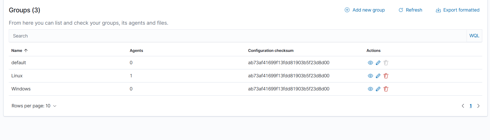
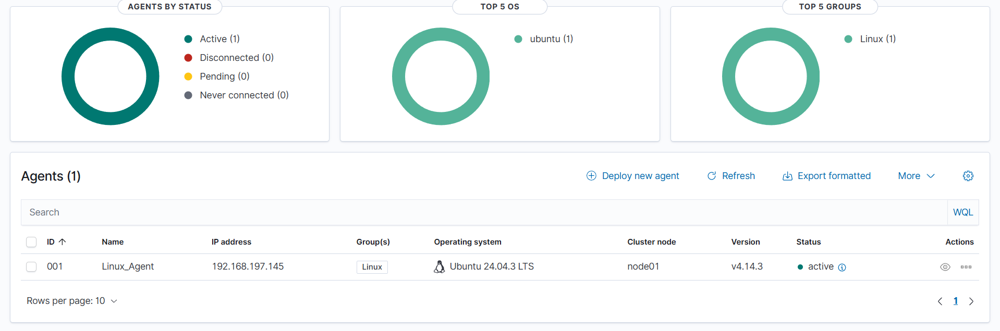
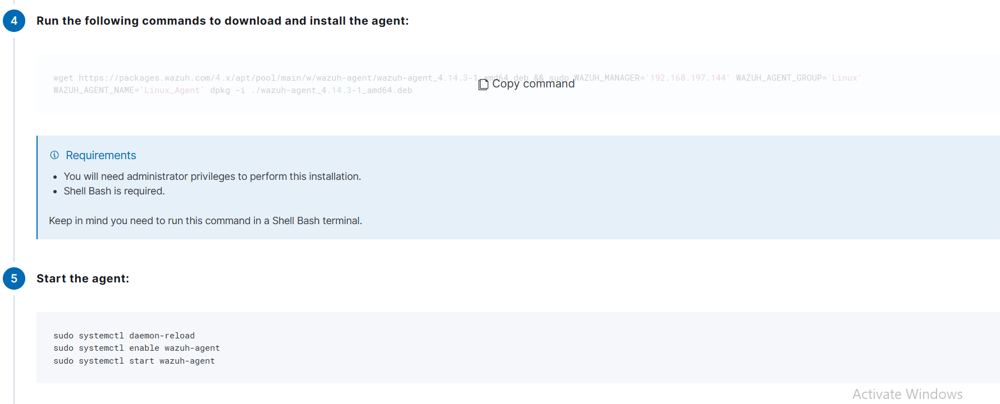
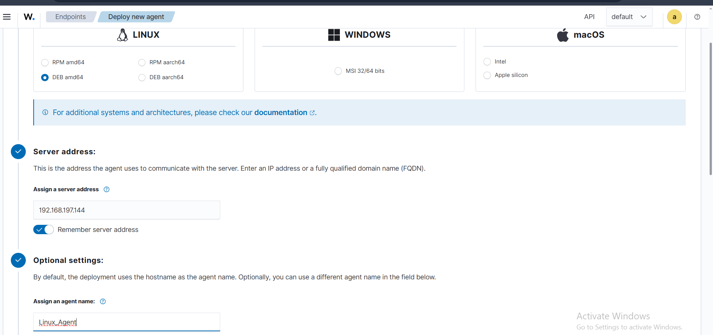
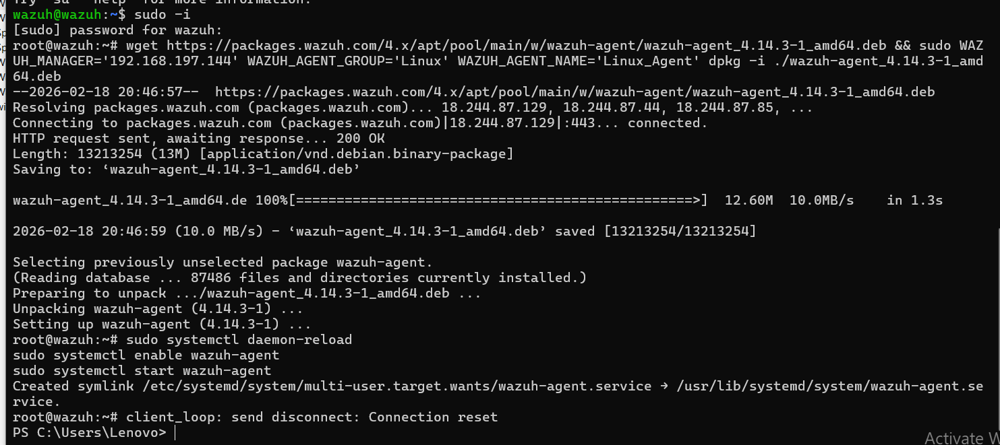

# 🐧 Linux Agent Installation

## Overview

A **Wazuh Agent** was deployed on an **Ubuntu 24.04 LTS** endpoint to enable centralized security monitoring. The agent collects logs, monitors file integrity, and reports events back to the Wazuh Manager in real time.

---

## Prerequisites

- Ubuntu endpoint (20.04 / 22.04 / 24.04)
- Network connectivity to the Wazuh Manager IP (`192.168.197.144`)
- Root or sudo access

---

## Step 1 — Deploy New Agent from Dashboard

In the Wazuh Dashboard, navigate to **Endpoints → Deploy new agent**.

Select the following options:

- **OS:** Linux → DEB amd64
- **Server address:** `192.168.197.144`
- **Agent name:** `Linux_Agent`
- **Agent group:** `Linux`



---

## Step 2 — Run Install Command on the Endpoint

The Dashboard generates the exact install command. Copy and run it on the Linux endpoint:

```bash
wget https://packages.wazuh.com/4.x/apt/pool/main/w/wazuh-agent/wazuh-agent_4.14.3-1_amd64.deb \
  && sudo WAZUH_MANAGER='192.168.197.144' \
     WAZUH_AGENT_GROUP='Linux' \
     WAZUH_AGENT_NAME='Linux_Agent' \
     dpkg -i ./wazuh-agent_4.14.3-1_amd64.deb
```



The terminal output shows the download and installation process:

```
Connecting to packages.wazuh.com|18.244.87.129|:443... connected.
HTTP request sent, awaiting response... 200 OK
Length: 13213254 (13M)
wazuh-agent_4.14.3-1_amd64.de 100%[===========>] 12.60M  10.0MB/s  in 1.3s

Selecting previously unselected package wazuh-agent.
Unpacking wazuh-agent (4.14.3-1) ...
Setting up wazuh-agent (4.14.3-1) ...
```

---

## Step 3 — Enable and Start the Agent Service

```bash
sudo systemctl daemon-reload
sudo systemctl enable wazuh-agent
sudo systemctl start wazuh-agent
```



> ✅ A systemd symlink is created automatically:
> `/etc/systemd/system/multi-user.target.wants/wazuh-agent.service`

---

## Step 4 — Verify Agent is Active on Dashboard

After starting the service, the agent appears in the Wazuh Dashboard under **Endpoints**.



| Field | Value |
|---|---|
| **ID** | 001 |
| **Name** | Linux_Agent |
| **IP Address** | 192.168.197.145 |
| **Group** | Linux |
| **OS** | Ubuntu 24.04.3 LTS |
| **Version** | v4.14.3 |
| **Status** | 🟢 Active |

The dashboard also shows:
- **Agents by Status:** Active (1)
- **Top 5 OS:** ubuntu (1)
- **Top 5 Groups:** Linux (1)

---

## Agent Groups

Agent groups allow centralized configuration management. The **Linux** group was created specifically for Linux endpoints.



| Group | Agents |
|---|---|
| default | 0 |
| Linux | 1 |
| Windows | 0 |

---

## Verify Connection

To confirm the agent is connected to the manager:

```bash
sudo systemctl status wazuh-agent
```

Expected output:
```
● wazuh-agent.service - Wazuh agent
     Active: active (running)
```

---

> 🔙 Back to [Main README](../README.md)
