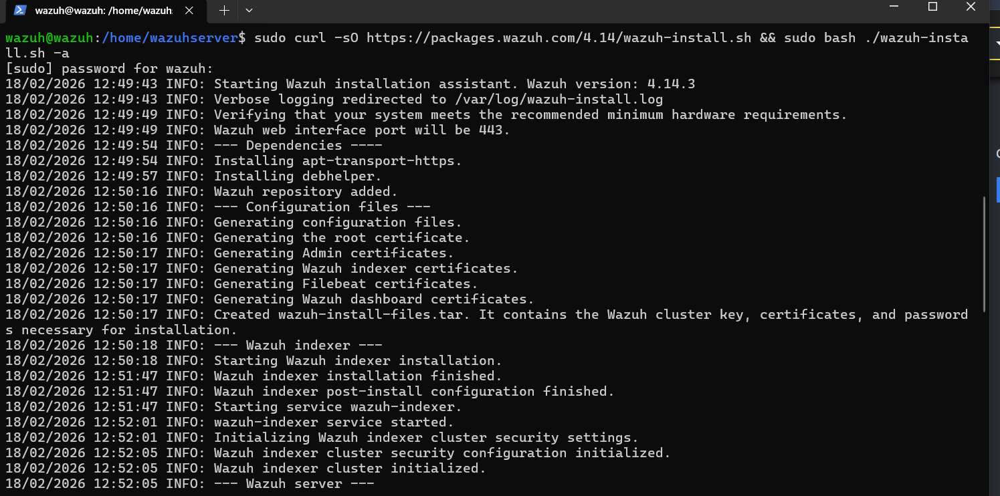
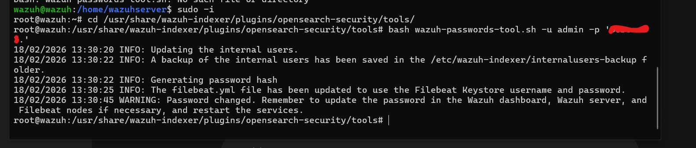

# 🖥️ Wazuh Server Installation

## Overview

Wazuh Server was deployed on an **Ubuntu Linux** machine using the official all-in-one installation script. This single command automatically installs and configures all three core components:

| Component | Role |
|---|---|
| **Wazuh Manager** | Central rule engine and alert processor |
| **Wazuh Indexer** | Data storage and search (OpenSearch-based) |
| **Wazuh Dashboard** | Web-based monitoring and visualization UI |

---

## Prerequisites

- Ubuntu 20.04 / 22.04 / 24.04 (64-bit)
- Minimum 4 GB RAM, 2 CPU cores
- At least 50 GB disk space
- Root or sudo access
- Open ports: `443` (Dashboard), `1514` (Agent communication), `1515` (Agent enrollment)

---

## Step 1 — Run the Installation Script

The official Wazuh installer handles everything automatically — dependencies, certificates, and all three components.

```bash
sudo curl -sO https://packages.wazuh.com/4.14/wazuh-install.sh && \
sudo bash ./wazuh-install.sh -a
```

### What the installer does automatically:

- ✅ Adds the Wazuh APT repository
- ✅ Installs required dependencies (`apt-transport-https`, `debhelper`, etc.)
- ✅ Generates SSL/TLS certificates for all components
- ✅ Installs and starts **Wazuh Indexer**
- ✅ Installs and starts **Wazuh Manager**
- ✅ Installs and starts **Wazuh Dashboard**

---

## Step 2 — Installation in Progress

The installer logs every step in real time. The process takes approximately **5–10 minutes** depending on hardware.



Key milestones visible in the log:

```
INFO: Starting Wazuh installation assistant. Wazuh version: 4.14.3
INFO: Verifying that your system meets the recommended minimum hardware requirements.
INFO: Wazuh web interface port will be 443.
INFO: --- Dependencies ----
INFO: Installing apt-transport-https.
INFO: Installing debhelper.
INFO: Wazuh repository added.
INFO: --- Configuration files ---
INFO: Generating configuration files.
INFO: Generating the root certificate.
INFO: Generating Admin certificates.
INFO: Generating Wazuh indexer certificates.
INFO: Generating Filebeat certificates.
INFO: Generating Wazuh dashboard certificates.
INFO: Created wazuh-install-files.tar.
INFO: --- Wazuh indexer ---
INFO: Starting Wazuh indexer installation.
INFO: Wazuh indexer installation finished.
INFO: wazuh-indexer service started.
INFO: --- Wazuh server ---
```

> 📌 The installer generates a `wazuh-install-files.tar` archive containing the cluster key, certificates, and passwords needed for the installation.

---

## Step 3 — Access the Dashboard

Once installation completes, open a browser and navigate to:

```
https://<YOUR_SERVER_IP>
```

Default credentials are displayed at the end of the installation output. Save them securely.

---

## Step 4 — Change Admin Password

After the initial login, the admin password should be changed immediately for security.

```bash
# Navigate to the security tools directory
cd /usr/share/wazuh-indexer/plugins/opensearch-security/tools/

# Change the admin password
bash wazuh-passwords-tool.sh -u admin -p 'YOUR_NEW_SECURE_PASSWORD'
```



### What happens during the password change:

```
INFO: Updating the internal users.
INFO: A backup of the internal users has been saved in the
      /etc/wazuh-indexer/internalusers-backup folder.
INFO: Generating password hash
INFO: The filebeat.yml file has been updated to use the Filebeat Keystore
      username and password.
WARNING: Password changed. Remember to update the password in the
         Wazuh dashboard, Wazuh server, and Filebeat nodes if necessary,
         and restart the services.
```

> ⚠️ After changing the password, restart the Wazuh Manager and Dashboard services to apply the changes.

```bash
sudo systemctl restart wazuh-manager
sudo systemctl restart wazuh-dashboard
```

---

## Generated Certificates

The installation automatically provisions the following SSL certificates for secure inter-component communication:

| Certificate | Purpose |
|---|---|
| Root Certificate | Certificate Authority for the cluster |
| Admin Certificate | Administrative API access |
| Wazuh Indexer Certificate | Secure indexer communication |
| Filebeat Certificate | Log shipper authentication |
| Dashboard Certificate | HTTPS web interface |

---

## Verify Services

```bash
sudo systemctl status wazuh-manager
sudo systemctl status wazuh-indexer
sudo systemctl status wazuh-dashboard
```

All three services should show `active (running)`.

---

> 🔙 Back to [Main README](../README.md)
