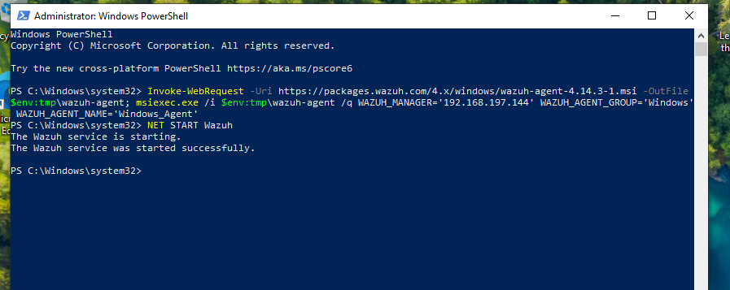
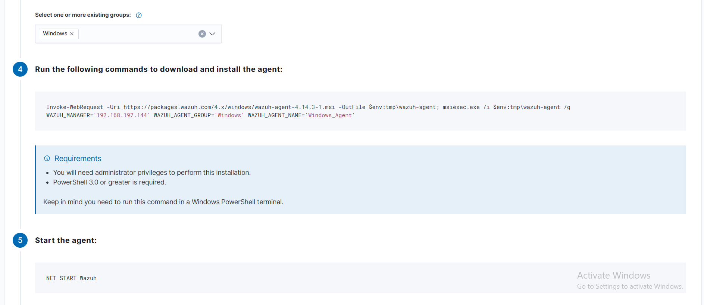
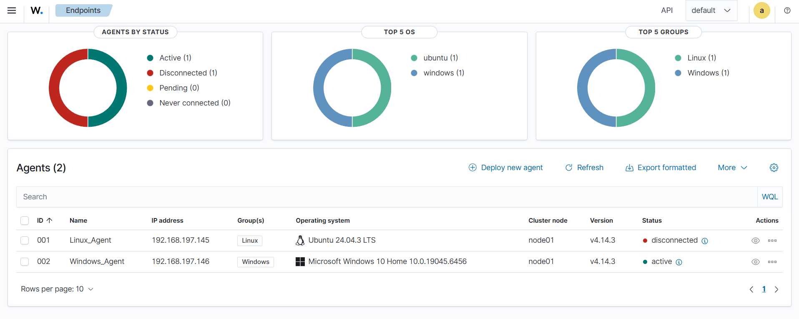

# 🪟 Windows Agent Installation

## Overview

A **Wazuh Agent** was deployed on a **Windows 10** endpoint to enable centralized security monitoring from a Windows machine. The agent is installed via PowerShell and connects to the Wazuh Manager automatically.

---

## Prerequisites

- Windows 10 / 11 or Windows Server 2016+
- **PowerShell 3.0** or greater
- **Administrator privileges**
- Network connectivity to the Wazuh Manager IP (`192.168.197.144`)

---

## Step 1 — Deploy New Agent from Dashboard

In the Wazuh Dashboard, navigate to **Endpoints → Deploy new agent**.

Select the following options:

- **OS:** Windows → MSI 32/64 bits
- **Server address:** `192.168.197.144`
- **Agent name:** `Windows_Agent`
- **Agent group:** `Windows`



---

## Step 2 — Run Install Command via PowerShell

Open **PowerShell as Administrator** and run the generated installation command:

```powershell
Invoke-WebRequest -Uri https://packages.wazuh.com/4.x/windows/wazuh-agent-4.14.3-1.msi `
  -OutFile $env:tmp\wazuh-agent; `
  msiexec.exe /i $env:tmp\wazuh-agent /q `
  WAZUH_MANAGER='192.168.197.144' `
  WAZUH_AGENT_GROUP='Windows' `
  WAZUH_AGENT_NAME='Windows_Agent'
```



> ℹ️ The `/q` flag runs the MSI installer silently with no user interaction required.

---

## Step 3 — Start the Agent Service

After installation completes, start the Wazuh service:

```powershell
NET START Wazuh
```

Expected output:
```
The Wazuh service is starting.
The Wazuh service was started successfully.
```



---

## Step 4 — Verify Agent on Dashboard

After the service starts, the Windows agent appears in the Wazuh Dashboard alongside the Linux agent.


| Field | Value |
|---|---|
| **ID** | 002 |
| **Name** | Windows_Agent |
| **IP Address** | 192.168.197.146 |
| **Group** | Windows |
| **OS** | Microsoft Windows 10 Home 10.0.19045.6456 |
| **Version** | v4.14.3 |
| **Status** | 🟢 Active |

---

## Both Agents Connected

With both agents deployed, the Endpoints overview shows the full lab environment:


| Agent | OS | Group | Status |
|---|---|---|---|
| Linux_Agent | Ubuntu 24.04.3 LTS | Linux | Active |
| Windows_Agent | Windows 10 Home | Windows | Active |

**Dashboard summary:**
- **Agents by Status:** Active (1), Disconnected (1)
- **Top 5 OS:** ubuntu (1), windows (1)
- **Top 5 Groups:** Linux (1), Windows (1)

---

## Troubleshooting

If the agent fails to connect, verify:

1. Wazuh Manager is running on `192.168.197.144`
2. Port `1514` (UDP/TCP) and `1515` (TCP) are open in the firewall
3. The agent service is running: check **Services** in Windows or run `Get-Service Wazuh` in PowerShell

---

> 🔙 Back to [Main README](../README.md)
