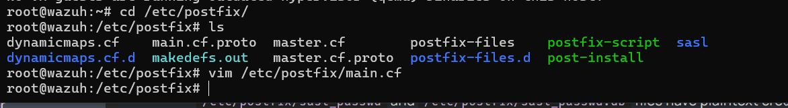
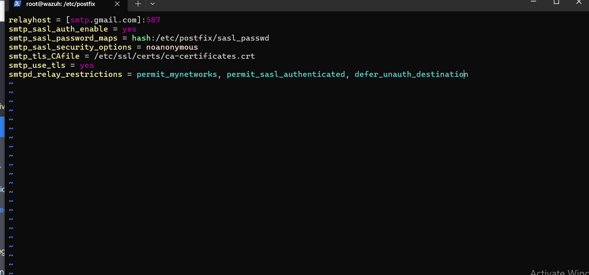
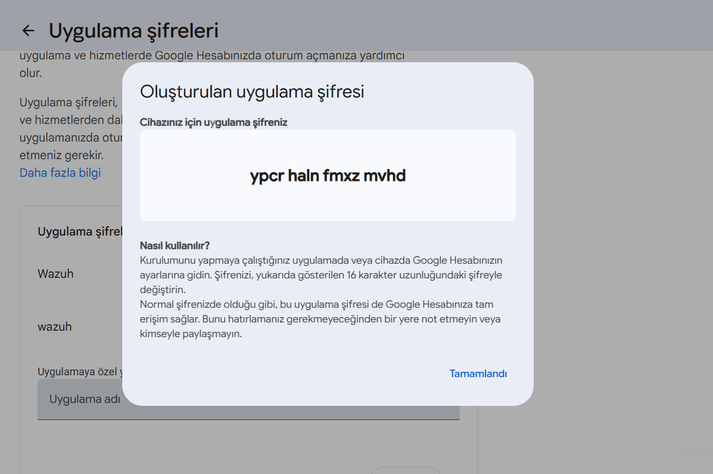
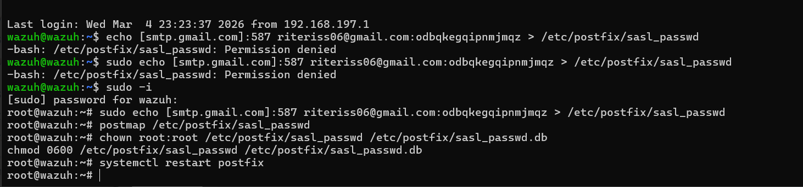
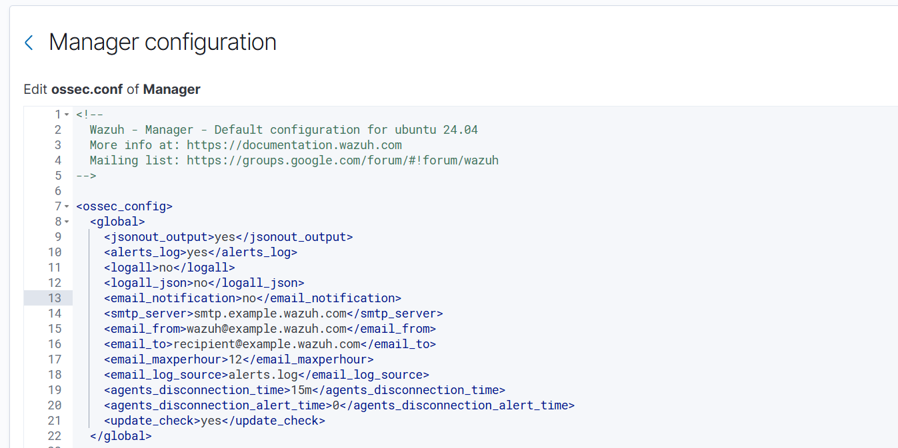
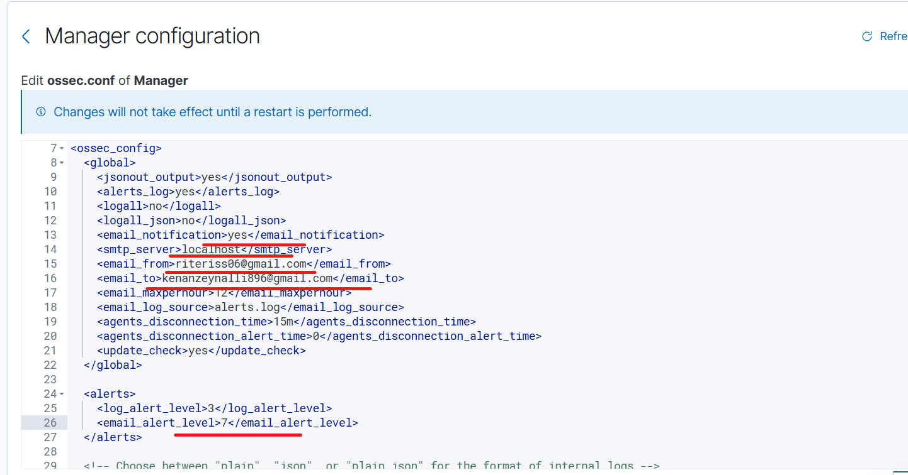
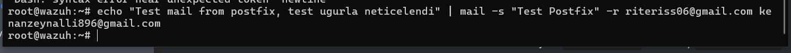
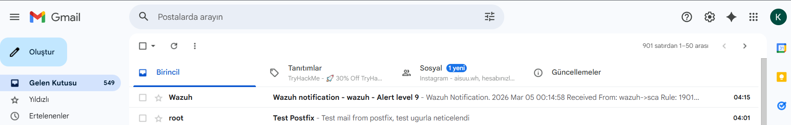
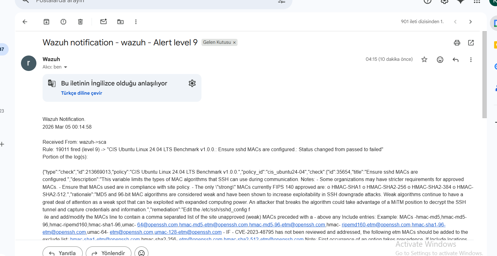
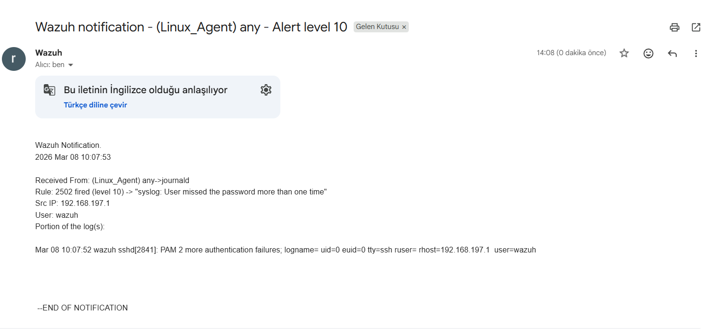

# 📧 Email Alert Integration

## Overview

Wazuh was configured to send real-time security alert emails using **Postfix** as the local mail server with **Gmail SMTP** as the relay. When a security event exceeds the configured alert level, Wazuh automatically dispatches a detailed notification email.

---

## How It Works

```
Wazuh Alert triggered (level ≥ 7)
         │
         ▼
  Wazuh Manager → sends to localhost:25
         │
         ▼
  Postfix (local MTA)
         │
         ▼
  Gmail SMTP relay → smtp.gmail.com:587 (TLS)
         │
         ▼
  Alert delivered to kenanzeynalli896@gmail.com
```

---

## Step 1 — Install Postfix

```bash
sudo apt-get install postfix mailutils libsasl2-2 \
  ca-certificates libsasl2-modules
```

When prompted, select **"Internet Site"** as the mail server configuration type.

---

## Step 2 — Navigate to Postfix Directory

```bash
cd /etc/postfix/
ls
vim /etc/postfix/main.cf
```



The `/etc/postfix/` directory contains: `main.cf`, `master.cf`, `sasl/`, `postfix-script`, and other configuration files.

---

## Step 3 — Configure main.cf

The Postfix `main.cf` was edited to relay emails through Gmail's SMTP server with TLS authentication:



```ini
relayhost = [smtp.gmail.com]:587
smtp_sasl_auth_enable = yes
smtp_sasl_password_maps = hash:/etc/postfix/sasl_passwd
smtp_sasl_security_options = noanonymous
smtp_tls_CAfile = /etc/ssl/certs/ca-certificates.crt
smtp_use_tls = yes
smtpd_relay_restrictions = permit_mynetworks, permit_sasl_authenticated, defer_unauth_destination
```

| Parameter | Value | Description |
|---|---|---|
| `relayhost` | `[smtp.gmail.com]:587` | Gmail SMTP server with STARTTLS port |
| `smtp_sasl_auth_enable` | `yes` | Enable SASL authentication |
| `smtp_sasl_password_maps` | `hash:/etc/postfix/sasl_passwd` | Path to credentials database |
| `smtp_sasl_security_options` | `noanonymous` | Require authentication |
| `smtp_use_tls` | `yes` | Enforce TLS encryption |

---

## Step 4 — Generate Google App Password

Since Gmail requires App Passwords for third-party SMTP access, a dedicated App Password was generated from the Google Account security settings.



**Steps to generate:**
1. Go to [myaccount.google.com](https://myaccount.google.com)
2. Security → 2-Step Verification (must be enabled)
3. App passwords → Create new → Name it "Wazuh"
4. Copy the generated 16-character password

> ⚠️ The App Password is shown only once. Store it securely before closing the dialog.

---

## Step 5 — Configure SASL Credentials

The Gmail credentials were saved to the Postfix SASL password file:



```bash
# Write credentials (requires root)
sudo -i
echo [smtp.gmail.com]:587 YOUR_EMAIL@gmail.com:YOUR_APP_PASSWORD > /etc/postfix/sasl_passwd

# Generate the hashed database
postmap /etc/postfix/sasl_passwd

# Set secure permissions
chown root:root /etc/postfix/sasl_passwd /etc/postfix/sasl_passwd.db
chmod 0600 /etc/postfix/sasl_passwd /etc/postfix/sasl_passwd.db

# Restart Postfix
systemctl restart postfix
```

> 🔒 The `chmod 0600` ensures only root can read the credentials file.

---

## Step 6 — Configure ossec.conf (Before & After)

### Before — Default Configuration

The default `ossec.conf` has email notifications **disabled** with placeholder values:



```xml
<global>
  <email_notification>no</email_notification>
  <smtp_server>smtp.example.wazuh.com</smtp_server>
  <email_from>wazuh@example.wazuh.com</email_from>
  <email_to>recipient@example.wazuh.com</email_to>
  <email_maxperhour>12</email_maxperhour>
</global>
```

### After — Updated Configuration

Email notifications were enabled and configured with real Gmail addresses:



```xml
<global>
  <jsonout_output>yes</jsonout_output>
  <alerts_log>yes</alerts_log>
  <email_notification>yes</email_notification>        <!-- ← Enabled -->
  <smtp_server>localhost</smtp_server>                <!-- ← Via local Postfix -->
  <email_from>riteriss06@gmail.com</email_from>       <!-- ← Sender address -->
  <email_to>kenanzeynalli896@gmail.com</email_to>     <!-- ← Recipient address -->
  <email_maxperhour>12</email_maxperhour>             <!-- ← Max 12 emails/hour -->
  <email_log_source>alerts.log</email_log_source>
  <agents_disconnection_time>15m</agents_disconnection_time>
</global>

<alerts>
  <log_alert_level>3</log_alert_level>
  <email_alert_level>7</email_alert_level>            <!-- ← Send email for level 7+ -->
</alerts>
```

| Parameter | Value | Description |
|---|---|---|
| `email_notification` | `yes` | Enables email alerting |
| `smtp_server` | `localhost` | Route through local Postfix |
| `email_from` | Gmail sender address | SMTP authenticated sender |
| `email_to` | Gmail recipient address | Alert destination inbox |
| `email_maxperhour` | `12` | Rate limit to prevent spam |
| `email_alert_level` | `7` | Only email alerts at level 7 or above |

---

## Step 7 — Send a Test Email

```bash
echo "Test mail from postfix, test ugurla neticelendi" | \
  mail -s "Test Postfix" -r riteriss06@gmail.com kenanzeynalli896@gmail.com
```



Command executed successfully with no errors.

---

## Step 8 — Verify Email Delivery

Both the test email and a live Wazuh alert were successfully received in Gmail:



The inbox shows two deliveries:
- **Wazuh notification — wazuh — Alert level 9** (04:15)
- **Test Postfix** — "Test mail from postfix, test ugurla neticelendi" (04:01)

---

## Step 9 — Live Alert Email Content

Opening the Wazuh alert email reveals full security context:



**Email Subject:** `Wazuh notification - wazuh - Alert level 9`

**Email Body:**
```
Wazuh Notification.
2026 Mar 05 00:14:58

Received From: wazuh->sca
Rule: 19011 fired (level 9) -> "CIS Ubuntu Linux 24.04 LTS Benchmark v1.0.0.:
Ensure sshd MACs are configured.: Status changed from passed to failed"
Portion of the log(s):

{
  "type": "check",
  "id": 213669013,
  "policy": "CIS Ubuntu Linux 24.04 LTS Benchmark v1.0.0.",
  "policy_id": "cis_ubuntu24-04",
  "check": {
    "id": 35654,
    "title": "Ensure sshd MACs are configured.",
    "description": "This variable limits the types of MAC algorithms
                    that SSH can use during communication..."
  }
}
```

The email contains:
- **Alert timestamp** and source agent
- **Rule ID** and **level** that triggered the alert
- **Full log payload** in JSON format with CIS benchmark details

---

## SSH Brute Force Alert Emails

In addition to compliance alerts, Wazuh also delivers real-time email notifications for active attacks detected on endpoints.

### Alert 1 — Brute Force Attack (Rule 2502, Level 10)

**Subject:** `Wazuh notification - (Linux_Agent) any - Alert level 10`



```
Wazuh Notification.
2026 Mar 08 10:07:53

Received From: (Linux_Agent) any->journald
Rule: 2502 fired (level 10) -> "syslog: User missed the password more than one time"
Src IP: 192.168.197.1
User: wazuh

Mar 08 10:07:52 wazuh sshd[2841]: PAM 2 more authentication failures;
  logname= uid=0 euid=0 tty=ssh ruser= rhost=192.168.197.1 user=wazuh
```

### Alert 2 — SSH Brute Force with Full Log (Rule 5763, Level 10)


```
Wazuh Notification.
2026 Mar 08 10:07:59

Received From: (Linux_Agent) any->journald
Rule: 5763 fired (level 10) -> "sshd: brute force trying to get access to the system. Authentication failed."
Src IP: 192.168.197.1
User: wazuh

Mar 08 10:07:58 wazuh sshd[2847]: Failed password for wazuh from 192.168.197.1 port 65194 ssh2
Mar 08 10:07:56 wazuh sshd[2845]: Failed password for wazuh from 192.168.197.1 port 65193 ssh2
Mar 08 10:07:56 wazuh sshd[2845]: Failed password for wazuh from 192.168.197.1 port 65193 ssh2
Mar 08 10:07:55 wazuh sshd[2843]: Failed password for wazuh from 192.168.197.1 port 65192 ssh2
Mar 08 10:07:55 wazuh sshd[2843]: Failed password for wazuh from 192.168.197.1 port 65192 ssh2
Mar 08 10:07:51 wazuh sshd[2841]: Failed password for wazuh from 192.168.197.1 port 65191 ssh2
...
--END OF NOTIFICATION
```

Both emails were triggered by a simulated SSH brute force attack against the **Linux_Agent**. Wazuh correlated the repeated failed authentication attempts and fired rule `5763` (level 10), delivering the alert to the configured Gmail inbox within seconds.

---

## Email Alert Levels

| Level | Description | Email Sent |
|---|---|---|
| 1–6 | Low severity events | ❌ No |
| **7–9** | **Medium — compliance failures, policy changes** | ✅ **Yes** |
| **10–12** | **High — brute force, malware detected** | ✅ **Yes** |
| **13–15** | **Critical** | ✅ **Yes** |

---

> 🔙 Back to [Main README](../README.md)
