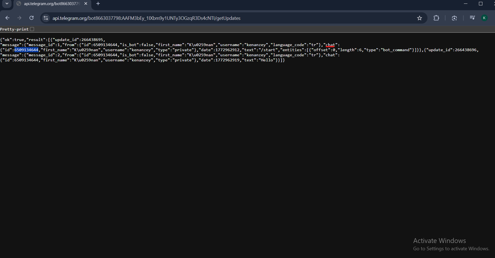
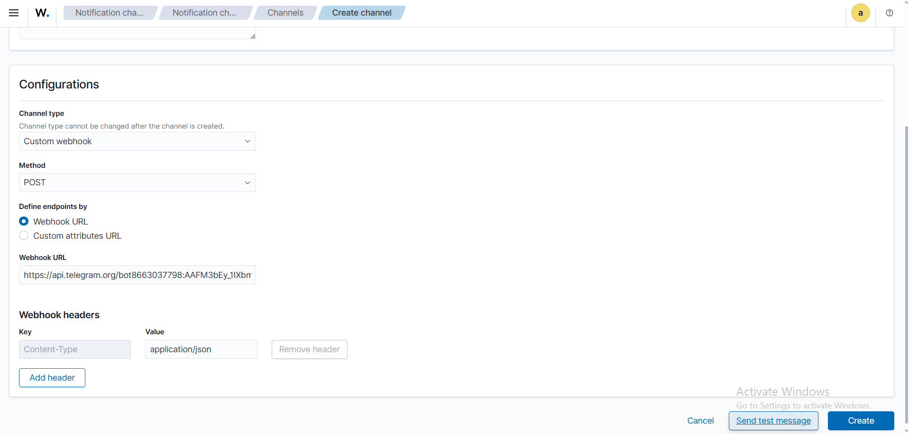
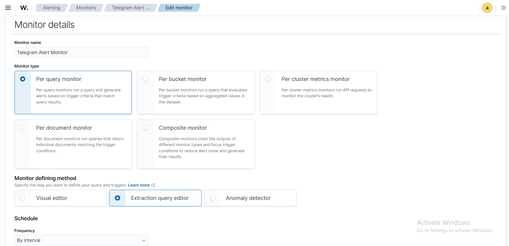
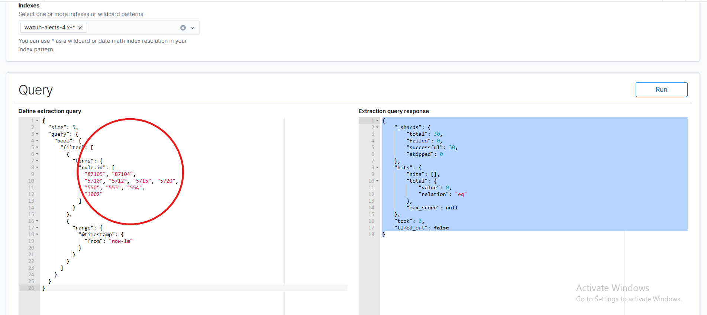
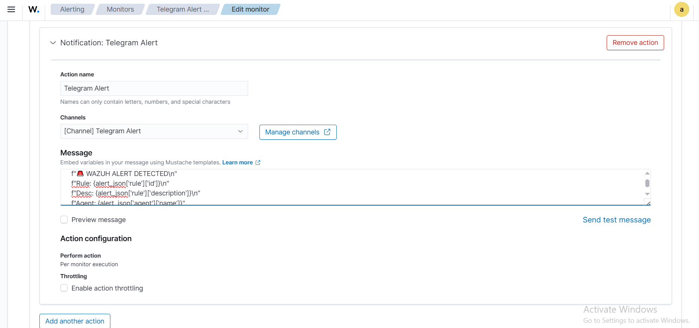
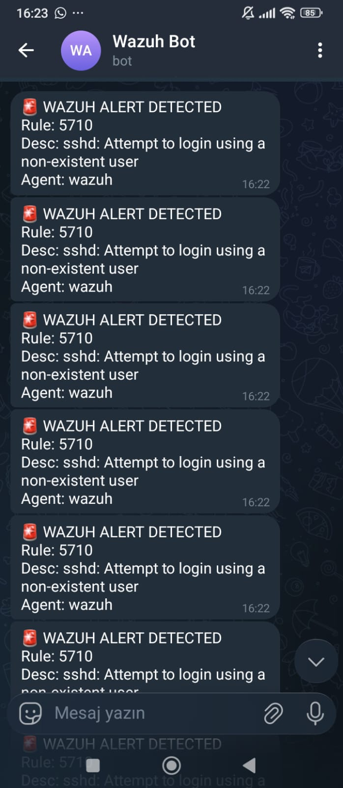

# 📲 Telegram Integration

## Overview

Wazuh was integrated with a **Telegram Bot** to deliver real-time security alert notifications directly to a mobile device. The integration uses Wazuh's built-in **Alerting & Monitors** feature with a **Custom Webhook** to push formatted messages to Telegram via the Bot API.

---

## How It Works

```
Wazuh Alert triggered (matching rule IDs)
         │
         ▼
  Alerting Monitor queries wazuh-alerts-4.x-* index
         │
         ▼
  Monitor trigger fires → Action executes
         │
         ▼
  Custom Webhook → POST to Telegram Bot API
         │
         ▼
  https://api.telegram.org/bot<TOKEN>/sendMessage
         │
         ▼
  Alert message delivered to Telegram (Wazuh Bot)
```

---

## Step 1 — Create a Telegram Bot & Get Bot Token

1. Open Telegram and search for **@BotFather**
2. Send `/newbot` and follow the prompts
3. Name the bot (e.g., **Wazuh Bot**) and set a username
4. BotFather returns a **Bot Token** in the format:
   ```
   1234567890:AAFxxxxxxxxxxxxxxxxxxxxxxxxxxxxxxxx
   ```

> 🔑 Store the token securely — it is used to authenticate all API calls.

---

## Step 2 — Retrieve the Chat ID

After creating the bot, send it any message (e.g., `/start` or `Hello`), then call the `getUpdates` endpoint to retrieve the `chat_id`:

```
https://api.telegram.org/bot<TOKEN>/getUpdates
```



The JSON response reveals the `chat.id` field (highlighted in blue):

```json
{
  "ok": true,
  "result": [{
    "update_id": 266438695,
    "message": {
      "message_id": 1,
      "from": {
        "id": 6509134644,
        "is_bot": false,
        "first_name": "Kenan",
        "username": "kenanzey"
      },
      "chat": {
        "id": 6509134644,
        "first_name": "Kenan",
        "username": "kenanzey",
        "type": "private"
      },
      "text": "/start"
    }
  }]
}
```

**Chat ID:** `6509134644` — this is the destination for all alert messages.

---

## Step 3 — Create a Notification Channel (Custom Webhook)

In Wazuh Dashboard, navigate to: **Alerting → Notification channels → Create channel**



| Setting | Value |
|---|---|
| **Channel type** | Custom webhook |
| **Method** | POST |
| **Define endpoints by** | Webhook URL |
| **Webhook URL** | `https://api.telegram.org/bot<TOKEN>/sendMessage` |
| **Header Key** | `Content-Type` |
| **Header Value** | `application/json` |

> ⚠️ Channel type cannot be changed after creation.

---

## Step 4 — Create the Alert Monitor

Navigate to: **Alerting → Monitors → Create monitor**

### Monitor Details



| Setting | Value |
|---|---|
| **Monitor name** | Telegram Alert Monitor |
| **Monitor type** | Per query monitor |
| **Monitor defining method** | Extraction query editor |
| **Schedule frequency** | By interval |
| **Index** | `wazuh-alerts-4.x-*` |

**Per query monitor** runs the query on the `wazuh-alerts-4.x-*` index every interval and fires a trigger when results are found.

---

### Monitor Query

The monitor uses an **Extraction Query** to filter specific rule IDs within the last 1 minute:



```json
{
  "size": 5,
  "query": {
    "bool": {
      "filter": [
        {
          "terms": {
            "rule.id": [
              "87105", "87104",
              "5710", "5712", "5715", "5720",
              "550", "553", "554",
              "1002"
            ]
          }
        },
        {
          "range": {
            "@timestamp": {
              "from": "now-1m"
            }
          }
        }
      ]
    }
  }
}
```

**Monitored Rule IDs:**

| Rule ID | Description |
|---|---|
| 87105 / 87104 | VirusTotal malware detection |
| 5710 | SSH login attempt with non-existent user |
| 5712 / 5715 / 5720 | SSH authentication failures |
| 550 / 553 / 554 | File integrity events |
| 1002 | Error message in log files |

---

## Step 5 — Configure the Trigger Action (Message Template)

The trigger action was configured to send a formatted message to the Telegram channel:



| Setting | Value |
|---|---|
| **Action name** | Telegram Alert |
| **Channel** | `[Channel] Telegram Alert` |
| **Perform action** | Per monitor execution |

**Message template** (Mustache format):

```
{
  "chat_id": "6509134644",
  "text": "🚨 WAZUH ALERT DETECTED\nRule: {{alert_json['rule']['id']}}\nDesc: {{alert_json['rule']['description']}}\nAgent: {{alert_json['agent']['name']}}"
}
```

The rendered message on Telegram:
```
🚨 WAZUH ALERT DETECTED
Rule: 5710
Desc: sshd: Attempt to login using a non-existent user
Agent: wazuh
```

---

## Step 6 — Live Alert Results on Telegram

After simulating SSH login attempts against the Linux Agent, real-time alerts began arriving in the **Wazuh Bot** chat:



Multiple rapid alerts confirm the brute-force simulation was successfully detected and forwarded to Telegram:

```
🚨 WAZUH ALERT DETECTED
Rule: 5710
Desc: sshd: Attempt to login using a non-existent user
Agent: wazuh
```

All messages delivered at **16:22**, confirming real-time performance — alerts arrived within seconds of the events being detected on the endpoint.

---

## Telegram Alert vs Email Alert

| Feature | Telegram | Email |
|---|---|---|
| Delivery speed | ⚡ Real-time (seconds) | ~Seconds to minutes |
| Mobile notification | ✅ Push notification | ✅ Depends on email app |
| Rich formatting | ✅ Mustache templates | ✅ Full HTML/text body |
| Rate limiting | Per monitor interval | `email_maxperhour` |
| Setup complexity | Medium (bot + monitor) | Medium (Postfix + SMTP) |
| Best for | Rapid threat response | Compliance reports & detailed logs |

---

> 🔙 Back to [Main README](../README.md)
