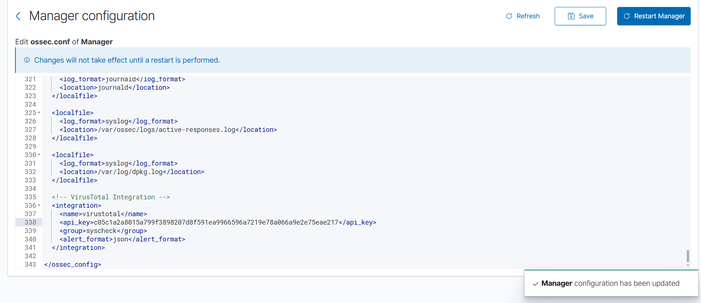
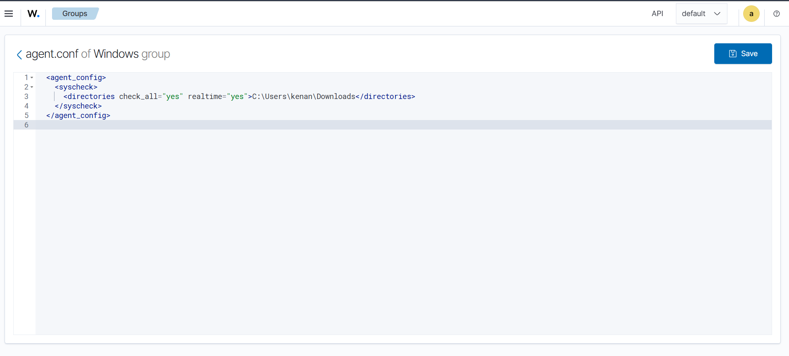
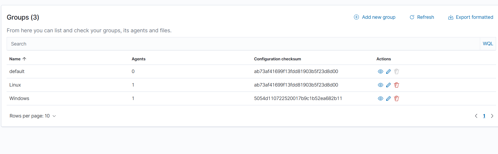
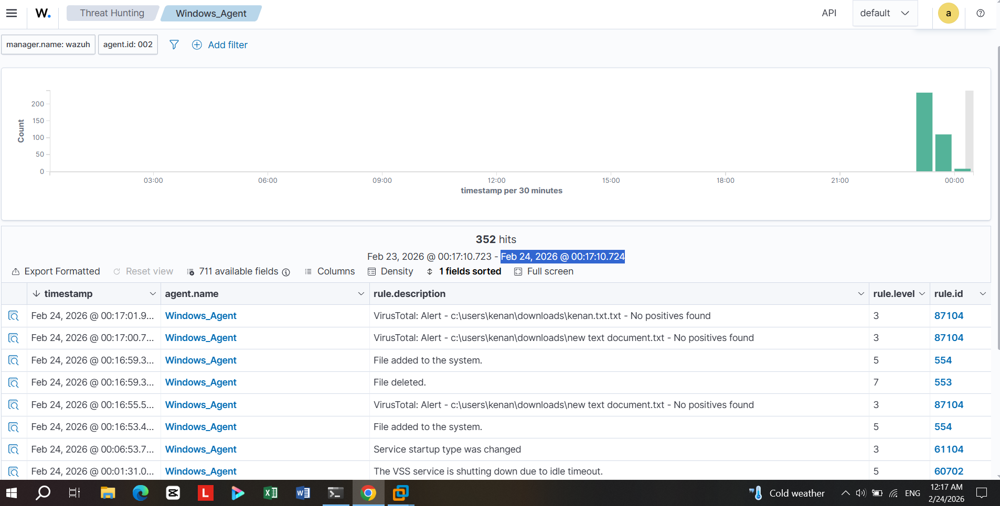

# 🦠 VirusTotal Integration

## Overview

Wazuh was integrated with the **VirusTotal API** to automatically scan files detected by File Integrity Monitoring (FIM). When a file is created or modified in a monitored directory, Wazuh sends its hash to VirusTotal and reports the result as a security alert on the Dashboard.

---

## How It Works

```
File Event (create/modify/delete)
         │
         ▼
  Wazuh FIM (syscheck)
         │
         ▼
  VirusTotal API (hash lookup)
         │
         ▼
  Alert generated → Dashboard (rule ID: 87104)
```

1. The Windows Agent monitors the `Downloads` folder in real time
2. Any file change triggers a **syscheck** event
3. Wazuh Manager sends the file hash to VirusTotal via API
4. The scan result is displayed as a `rule.id: 87104` alert on the Dashboard

---

## Step 1 — Configure VirusTotal in ossec.conf

The VirusTotal integration block was added to the **Manager configuration** (`ossec.conf`) directly from the Wazuh Dashboard.

Navigate to: **Server Management → Settings → Manager Configuration**



The following XML block was added at the end of the configuration file (lines 335–341):

```xml
<!-- VirusTotal Integration -->
<integration>
  <name>virustotal</name>
  <api_key>YOUR_VIRUSTOTAL_API_KEY</api_key>
  <group>syscheck</group>
  <alert_format>json</alert_format>
</integration>
```

| Parameter | Value | Description |
|---|---|---|
| `name` | `virustotal` | Integration identifier |
| `api_key` | Your VT API key | Free key from virustotal.com |
| `group` | `syscheck` | Trigger on FIM events only |
| `alert_format` | `json` | Alert output format |

> ✅ Success message: *"Manager configuration has been updated"*
> ⚠️ Click **Restart Manager** for changes to take effect.

---

## Step 2 — Configure FIM on Windows Agent Group

File Integrity Monitoring was configured for the **Windows group** via the agent group configuration in the Dashboard.

Navigate to: **Server Management → Groups → Windows → Edit agent.conf**



```xml
<agent_config>
  <syscheck>
    <directories check_all="yes" realtime="yes">C:\Users\kenan\Downloads</directories>
  </syscheck>
</agent_config>
```

| Attribute | Value | Description |
|---|---|---|
| `check_all` | `yes` | Monitor all file attributes (hash, size, permissions, owner) |
| `realtime` | `yes` | Detect changes instantly without waiting for a scheduled scan |
| Path | `C:\Users\kenan\Downloads` | Target directory under surveillance |

This configuration was applied to the **Windows group**, which automatically pushed the settings to all agents in that group.

---

## Step 3 — Verify Agent Group Configuration

After saving the `agent.conf`, the Windows group configuration checksum updated — confirming the new FIM policy was applied to the Windows agent.



| Group | Agents | Config Checksum |
|---|---|---|
| default | 0 | ab73af41699f13fdd81903b5f23d8d00 |
| Linux | 1 | ab73af41699f13fdd81903b5f23d8d00 |
| Windows | 1 | **5054d110722520017b9c1b52ea682b11** ← Updated |

The Windows group now has a different checksum from the default, confirming the custom FIM configuration was successfully applied.

---

## Step 4 — VirusTotal Alerts on Dashboard

Once a file was created or modified in the monitored `Downloads` folder, Wazuh detected the event and automatically queried VirusTotal. The results appeared in the **Threat Hunting** view under the **Windows_Agent** filter.



**352 total events** were captured in the observed time window (Feb 23–24, 2026).

### Sample Alert Events

| Timestamp | Agent | Rule Description | Level | Rule ID |
|---|---|---|---|---|
| Feb 24, 2026 @ 00:17:01 | Windows_Agent | VirusTotal: Alert - `kenan.txt.txt` - **No positives found** | 3 | 87104 |
| Feb 24, 2026 @ 00:17:00 | Windows_Agent | VirusTotal: Alert - `new text document.txt` - **No positives found** | 3 | 87104 |
| Feb 24, 2026 @ 00:16:59 | Windows_Agent | File added to the system | 5 | 554 |
| Feb 24, 2026 @ 00:16:59 | Windows_Agent | File deleted | 7 | 553 |
| Feb 24, 2026 @ 00:16:55 | Windows_Agent | VirusTotal: Alert - `new text document.txt` - **No positives found** | 3 | 87104 |

### Rule ID Reference

| Rule ID | Description |
|---|---|
| **87104** | VirusTotal scan result — file hash lookup response |
| **554** | File added to the system (FIM detection) |
| **553** | File deleted from the system (FIM detection) |
| **61104** | Service startup type changed |
| **60702** | VSS service shutting down due to idle timeout |

---

## FIM Event Types Detected

The integration successfully captures all three FIM event categories:

- ✅ **File created** → triggers VirusTotal scan → rule 87104
- ✅ **File modified** → triggers VirusTotal scan → rule 87104
- ✅ **File deleted** → logged as rule 553 (no hash to scan)

---

## Notes

- The **free VirusTotal API** has a rate limit of 4 requests/minute and 500 requests/day
- Files are identified by their **MD5/SHA256 hash** — no file content is sent to VirusTotal
- A result of **"No positives found"** means the file is clean across all antivirus engines on VirusTotal
- If any engine flags the file, the alert level increases and can trigger an Active Response

---

> 🔙 Back to [Main README](../README.md)
