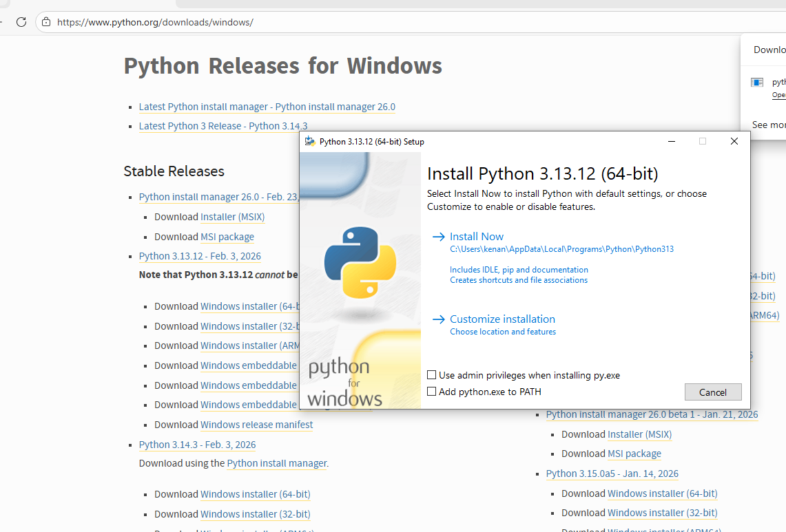
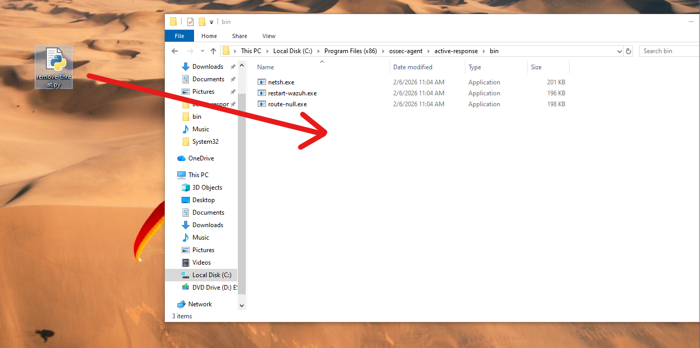
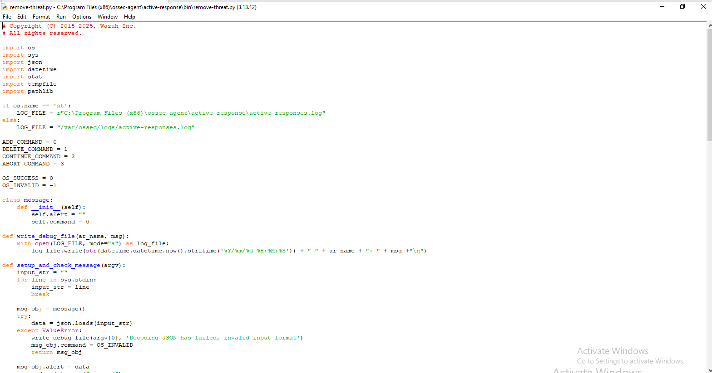
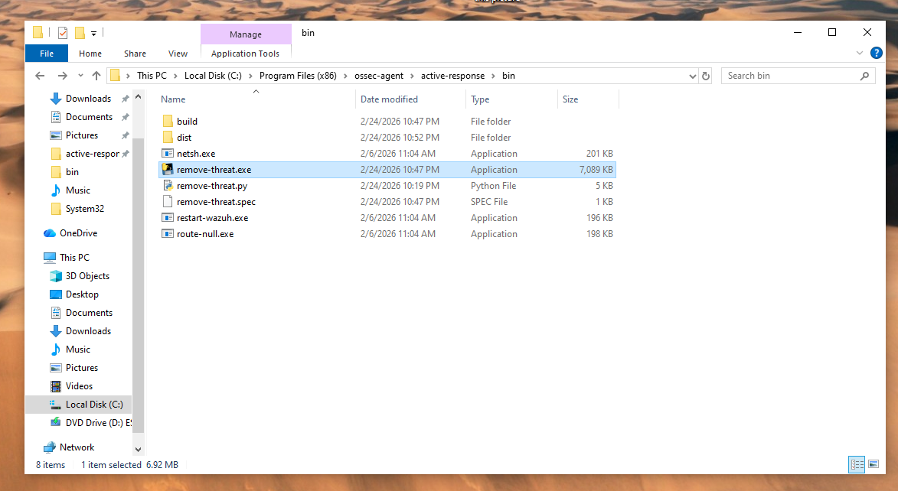
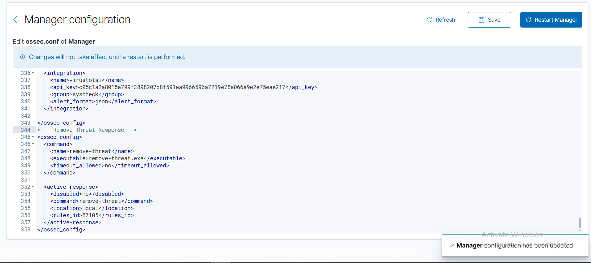
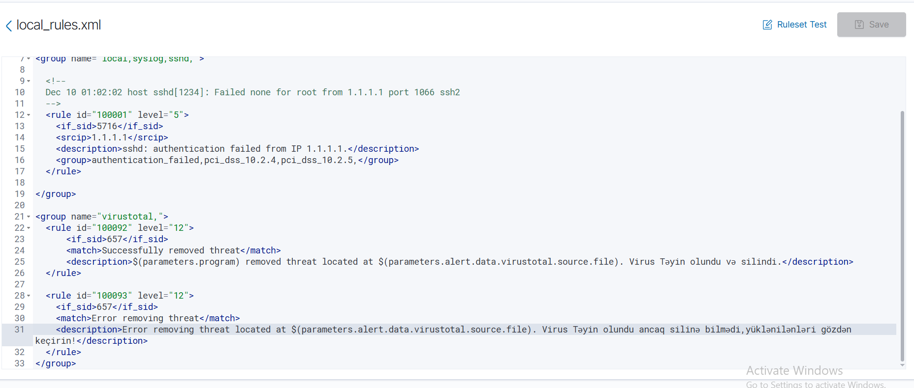
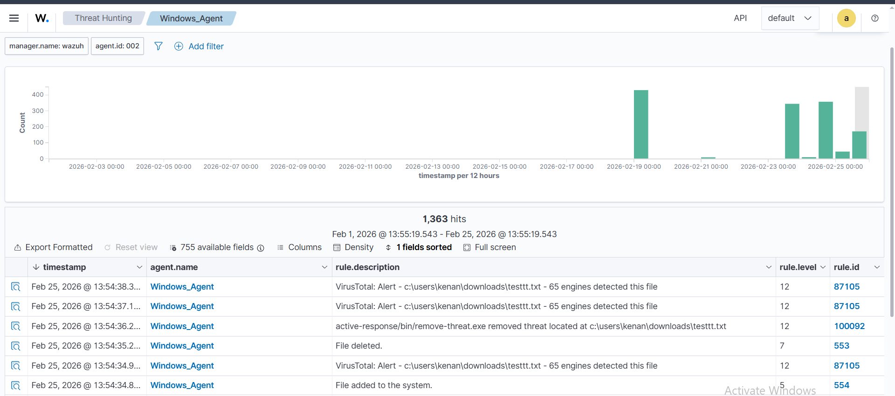
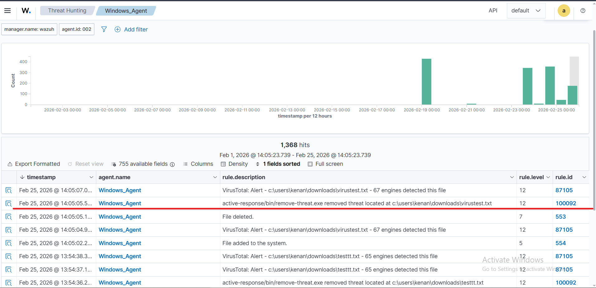

# 🐍 Python Threat Removal Script

## Overview

A custom **Active Response script** (`remove-threat.py`) was developed and deployed on the Windows Agent. When VirusTotal detects a malicious file (rule `87105`, level 12), Wazuh automatically triggers this script to **delete the threat from the endpoint** and log the action as rule `100092`.

---

## How It Works

```
VirusTotal Alert: file flagged by N engines (rule 87105, level 12)
              │
              ▼
  Wazuh Manager triggers Active Response → remove-threat
              │
              ▼
  remove-threat.exe runs on Windows Agent
              │
              ▼
  Malicious file securely deleted from disk
              │
              ▼
  Rule 100092: "remove-threat.exe removed threat located at <path>"
```

---

## Step 1 — Install Python on Windows Agent

Python **3.13.12** was installed on the Windows endpoint to run the active response script.



> ⚠️ Python must be installed before compiling the script to `.exe` with PyInstaller.

---

## Step 2 — Place the Script in the Active Response Directory

The `remove-threat.py` script was copied into the Wazuh active response `bin` directory:

```
C:\Program Files (x86)\ossec-agent\active-response\bin\
```



---

## Step 3 — The Python Script

The script was opened and verified in Python IDLE before compilation:



**Script:** [`remove-threat.py`](../scripts/remove-threat.py)

### Key Functions

| Function | Description |
|---|---|
| `setup_and_check_message()` | Reads the alert JSON from stdin sent by Wazuh Manager |
| `secure_delete_file()` | Safely validates and deletes the flagged file |
| `send_keys_and_check_message()` | Confirms with Manager whether to continue or abort |
| `write_debug_file()` | Logs all actions to `active-responses.log` |

### Security Checks in `secure_delete_file()`

The deletion function includes multiple safeguards before removing any file:

```python
# Reject NTFS alternate data streams
if '::' in filepath_str:
    raise Exception(f"Refusing to delete ADS or NTFS stream: {filepath_str}")

# Reject symbolic links and reparse points
if os.path.islink(filepath):
    raise Exception(f"Refusing to delete symbolic link: {filepath}")

# Ensure it's a regular file before deletion
if not resolved_filepath.is_file():
    raise Exception(f"Target is not a regular file: {resolved_filepath}")
```

### Log File Paths

```python
# Windows
LOG_FILE = "C:\\Program Files (x86)\\ossec-agent\\active-response\\active-responses.log"

# Linux/macOS
LOG_FILE = "/var/ossec/logs/active-responses.log"
```

---

## Step 4 — Compile to Executable

The Python script was compiled into a Windows executable using **PyInstaller**:

```bash
pyinstaller -F remove-threat.py
```

The compiled `remove-threat.exe` (7,089 KB) was placed in the `bin` directory alongside the original script:



**Files in** `C:\Program Files (x86)\ossec-agent\active-response\bin\`:

| File | Type | Size | Description |
|---|---|---|---|
| `remove-threat.exe` | Application | 7,089 KB | Compiled active response binary |
| `remove-threat.py` | Python File | 5 KB | Source script |
| `remove-threat.spec` | SPEC File | 1 KB | PyInstaller build spec |
| `netsh.exe` | Application | 201 KB | Built-in Wazuh tool |
| `restart-wazuh.exe` | Application | 196 KB | Built-in Wazuh tool |

---

## Step 5 — Configure ossec.conf (Manager)

The `remove-threat` command and active response were registered in the Manager configuration:



```xml
<!-- Remove Threat Response -->
<ossec_config>
  <command>
    <name>remove-threat</name>
    <executable>remove-threat.exe</executable>
    <timeout_allowed>no</timeout_allowed>
  </command>

  <active-response>
    <disabled>no</disabled>
    <command>remove-threat</command>
    <location>local</location>
    <rules_id>87105</rules_id>
  </active-response>
</ossec_config>
```

| Parameter | Value | Description |
|---|---|---|
| `executable` | `remove-threat.exe` | Compiled binary name |
| `timeout_allowed` | `no` | Script runs until completion |
| `rules_id` | `87105` | Trigger when VT detects malware |
| `location` | `local` | Run on the agent where file was found |

> ✅ *"Manager configuration has been updated"*

---

## Step 6 — Add Custom Rules to local_rules.xml

Two custom rules were created to alert when the script succeeds or fails:



```xml
<group name="virustotal,">

  <!-- Rule: Threat successfully removed -->
  <rule id="100092" level="12">
    <if_sid>657</if_sid>
    <match>Successfully removed threat</match>
    <description>$(parameters.program) removed threat located at
      $(parameters.alert.data.virustotal.source.file).
      Virus detected and deleted.</description>
  </rule>

  <!-- Rule: Error during threat removal -->
  <rule id="100093" level="12">
    <if_sid>657</if_sid>
    <match>Error removing threat</match>
    <description>Error removing threat located at
      $(parameters.alert.data.virustotal.source.file).
      Virus detected but could not be deleted — check Downloads!</description>
  </rule>

</group>
```

| Rule ID | Match | Description |
|---|---|---|
| **100092** | `Successfully removed threat` | File was deleted successfully |
| **100093** | `Error removing threat` | Deletion failed — manual action needed |

---

## Step 7 — Results on Dashboard

### First Test — `testtt.txt` (65 engines detected)



The sequence for `testtt.txt`:

| Timestamp | Description | Level | Rule ID |
|---|---|---|---|
| 13:54:38 | VirusTotal: `testtt.txt` — **65 engines detected** | 12 | 87105 |
| 13:54:37 | VirusTotal: `testtt.txt` — **65 engines detected** | 12 | 87105 |
| 13:54:36 | **remove-threat.exe removed threat** at `testtt.txt` | 12 | **100092** |
| 13:54:35 | File deleted | 7 | 553 |
| 13:54:34 | VirusTotal: `testtt.txt` — 65 engines detected | 12 | 87105 |
| 13:54:34 | File added to the system | 5 | 554 |

### Second Test — `virustest.txt` (67 engines detected)



The same automated flow for `virustest.txt`:

| Timestamp | Description | Level | Rule ID |
|---|---|---|---|
| 14:05:07 | VirusTotal: `virustest.txt` — **67 engines detected** | 12 | 87105 |
| 14:05:05 | **remove-threat.exe removed threat** at `virustest.txt` | 12 | **100092** ← highlighted |
| 14:05:05 | File deleted | 7 | 553 |
| 14:05:04 | VirusTotal: `virustest.txt` — 67 engines detected | 12 | 87105 |
| 14:05:02 | File added to the system | 5 | 554 |

**Total events captured: 1,368 hits** across the full test period (Feb 1 – Feb 25, 2026).

---

## End-to-End Flow Summary

```
1. Malicious file dropped into C:\Users\kenan\Downloads\
2. FIM (syscheck) detects new file → rule 554
3. VirusTotal scans hash → N engines flagged → rule 87105 (level 12)
4. Active Response triggers → remove-threat.exe executes
5. File securely deleted from disk → rule 553
6. Success logged → rule 100092 (level 12)
```

---

> 🔙 Back to [Main README](../README.md)
